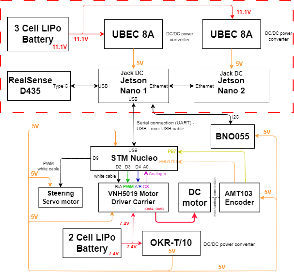

# Bosch2023_Brain

# To do task 
- [x] [Lane Detection](https://github.com/dotrannhattuong/Bosch2023_Brain/blob/main/utils/my_unet.py) 
- [x] [Object Detection](https://github.com/dotrannhattuong/Bosch2023_Brain/blob/main/docs/README_YOLO.md) - [Inference](https://github.com/dotrannhattuong/Bosch2023_Brain/blob/main/utils/detect_yolo.py)
- [x] [Communication Jetson Nano with NucleoF401RE](https://github.com/dotrannhattuong/Bosch2023_Brain/blob/main/utils/ser.py)
- [x] Master-Slave Communication Between Two Jetson Nano
- [x] [IMU](https://github.com/dotrannhattuong/Bosch2023_Brain/blob/main/docs/README_IMU.md) [Inference](https://github.com/dotrannhattuong/Bosch2023_Brain/blob/main/utils/my_bno055.py)
- [x] [RealSense](https://github.com/dotrannhattuong/Bosch2023_Brain/blob/main/utils/my_realsense.py)

# Diagram
<p align="center">
 
</p>

# [Dataset](https://github.com/dotrannhattuong/Bosch2023_Brain/releases/tag/Dataset)
## <div align="center">Overview</div>
<p align="center">
 
</p>

# Training
- [Unet](https://github.com/dotrannhattuong/Bosch2023_Brain/training)
- [Yolov7](https://github.com/WongKinYiu/yolov7)

# Starting
```
sh start_od.sh
sh start_seg.sh
```